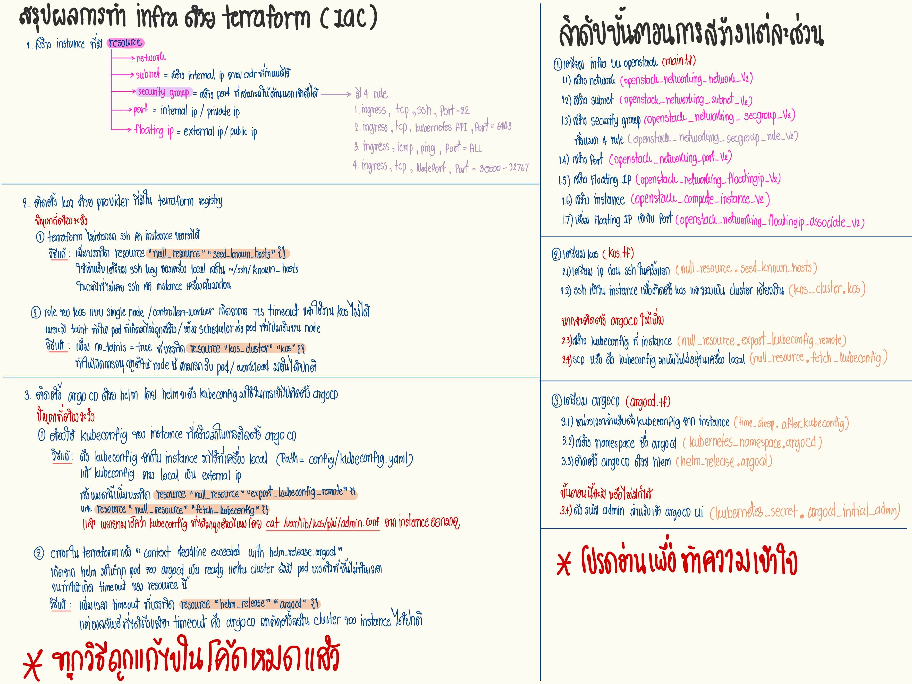

# Demo Web app สำหรับการ deploy ใน infra นี้
https://github.com/Berubell9/todolist-appilcation

# How to start Terraform

```base
terraform init
```
```base
terraform plan
```
```base
terraform apply

# เเบบที่ไม่ต้องมาพิมพ์ 'yes'
terraform apply -auto-approve
```
```base
terraform destroy

# เเบบที่ไม่ต้องมาพิมพ์ 'yes'
terraform destroy -auto-approve
```

# Pls Read Me!
### ข้่อมูลไฟล์
- **main.tf** = เตรียมเครื่อง Instance สำหรับ Infra
- **variable.tf** = รวมตัวเเปรที่ใช้ (เวลาเเก้ค่าต่างๆ ให้มาเเก้ในนี้)
- **output.tf** = เเสดงข้อมูลหลังจากสร้างเสร็จใน terminal
- **provider.tf** = เป็นการดึงข้อมูลของผู้ให้บริการที่อยู่ในเว็บ Registry ของ Terraform
- **k0s.tf** = ติดตั้ง k0s ลงเครื่อง Instance
- **argocd.tf** = ติดตั้ง Argo CD ลงเครื่อง Instance

### ข้อมูลโฟลเดอร์
- **infra+k0s** = instance ที่ติดตั้ง k0s
    - **AZ_BKK** = instance ฝั่ง BKK -> จำนวน 2 เครื่อง
    - **AZ_NON** = instance ฝั่ง NON
- **infra+k0s+argocd** = instance ที่ติดตั้ง k0s เเละ Argo CD


